# 系统架构与数据流分析 (System Design & Dataflow)

## 1. 核心状态存储 (KV) 是如何使用的？

在 Cloudflare Workers 中，**KV (Key-Value) Namespace** 类似于一个全局分布式的 NoSQL 数据库实例，而你存在里面的内容（如 `ADD.txt`, `config.json`）就是具体的 **KV Pairs (键值对)**。

在本项目 `edgetunnel` 中，`env.KV` 被用作核心的轻量级控制平面存储：

- **KV Namespace (数据库本身)**：我们在 `wrangler.toml` 中通过 `binding = "KV"` 告诉 Cloudflare：请在 Workers 运行时，把 ID 为 `272b...` 的这个 KV 数据库挂载到脚本变量 `env.KV` 上。
- **KV Pairs (存储的具体配置表)**：
  - `config.json`：存储全局代理协议配置、UUID 密钥、节点设置。Worker 每次处理订阅生成之前，会调用 `env.KV.get('config.json')` 读取。
  - `ADD.txt`：纯文本的值，里面是以换行符分隔的“优选代理 IP”列表。
  - `tg.json` / `cf.json`：Telegram 报警配置与 Cloudflare API 监控配置。
  - `login_attempts_<ip>`：我们在安全加固中新增的键，其值是一个带时间戳的 JSON，并且巧妙使用了 Cloudflare KV 的原生 `expirationTtl`（过期时间）特性，在 5 分钟后由于 TTL 到期，KV 会自动删除这条记录，实现状态清理。

---

## 2. 系统核心数据流图 (Dataflow)

以下是 `edgetunnel` 接收公网请求后的处理闭环。由于运行在 Cloudflare 边缘节点，所有的请求都会在一个隔离的 V8 Isolate 沙盒中执行：

```mermaid
sequenceDiagram
    participant Client as VPN/代理客户端 (V2ray/Clash)
    participant CF_Edge as Cloudflare 边缘节点 (Worker)
    participant KV as Cloudflare KV 存储
    participant ProxyIP as 优选代理出口 (ProxyIP)
    participant Internet as 目标互联网 (Google/Youtube 等)

    Client->>CF_Edge: 发起 HTTP / WS / gRPC 请求
    
    rect rgb(30, 30, 30)
    Note over CF_Edge: 1. 流量类型嗅探与鉴权拦截
    alt 访问 /sub (获取订阅)
        CF_Edge->>KV: 读取 config.json 和 ADD.txt (优选IP)
        KV-->>CF_Edge: 返回配置
        CF_Edge-->>Client: 根据 UA 生成 Clash/V2ray 订阅长文
    else 访问 /admin (后台管理)
        CF_Edge->>KV: 读取/写入配置
        CF_Edge-->>Client: 渲染 Dashboard 页面 / 限流拦截
    else 协议层连接 (WebSocket / XHTTP)
        CF_Edge->>CF_Edge: 校验 UUID 或 Password 握手
        CF_Edge->>KV: (可选) 获取自定义的 ProxyIP 池
        CF_Edge->>CF_Edge: 随机选取一个 ProxyIP 逃避阻断
    end
    end

    rect rgb(30, 40, 50)
    Note over CF_Edge, Internet: 2. 隧道网络穿透阶段 (Dataflow)
    CF_Edge->>ProxyIP: 建立底层 Socket 连接 (CF Sockets API)
    Note right of ProxyIP: 将请求伪装成正常流量
    ProxyIP->>Internet: 转发解包后的真实请求 (HTTP/TCP/UDP)
    Internet-->>ProxyIP: 服务器回包
    ProxyIP-->>CF_Edge: 隧道回传
    CF_Edge-->>Client: 封装回 WebSocket/XHTTP 帧并返回
    end
```

---

## 3. 如何撑起更高的稳定性与带宽 (Scaling & Stability)

Cloudflare Workers Free Tier 虽然强大，但并非为长连接高带宽高持续性隧道设计的。如果有上万并发或视频级的大型专线需求，目前纯免费架构极度容易碰到“墙”或者 CF 的平台阈值阻断。为了撑起高质量高可用环境，需要从以下维度改造：

### A. 优选出口层 (ProxyIP) 的高可用
- **现状**：代码中使用了公共的 `ProxyIP` 或 `ADD.txt` 里的扫描 IP。这些公用 IP 存活率低，随时会挂掉，且跨国路由极不稳定。
- **改造方案——建立高防专线节点池**：放弃扫盲性质的公共 IP，购买真正稳定的 BGP 云服务器充当落地出口。
- **健康检查**：Worker 不应该被动等待 Socket 报错断开。应当单独写一个定时触发器 (Cron Triggers) 去循环 Ping 测试 `ADD.txt` 中的 IP 池持续延迟，将死掉的节点自动踢出 KV，确保 Worker 拿到的永远是极速节点。

### B. Cloudflare 平台底层的极限突破
- **现状**：免费版 Workers 有 **50ms 的 CPU 绝对计算时间**、最大 **100个并发子请求(Sub-request)** 和极端的**未激活长连接自动断开**限制（WebSocket idle time）。
- **改造方案**：
  1. **开启传输复用 (Multiplexing)**：目前客户端大部分采用 Xray 连接，要在客户端及云端极致开启 Mux (多路复用) 或使用 gRPC/XHTTP 实现并发承载。这样可以在 1 个 TCP 上复用多个请求流，大幅降低对 Worker 并发连接配额的索取。
  2. **Worker 升杯**：升级到 Cloudflare Workers Paid Plan (Bound)，这能直接解锁无限制或巨大的持久运行时间（Wall Time）和巨量带宽高配网络。这是真正做商用隧道的底层硬件基石。

### C. GFW 侧的防主动探测 (Active Probing Defense)
- **现状**：即使请求全封装在 TLS 下，长时间大流量也会招致深度包检测设备 (DPI) 的阻断，从而导致国内到 Cloudflare 节点直接被 TCP RST（重置），这是“掉线”的主因。
- **改造方案——REALITY 或 分片 (Fragment) 配合**：
  1. 优化 `config.json` 测配置支持下发更加极致的 `Fragment` (TLS握手分片) 参数绕过 SNI 阻断。
  2. 启用客户端前置分流（Routing Rules）：所有国内主流网站、视频应用**直连**，不走代理。严禁让 BT 下载流量跑入 Cloudflare 隧道。既降低了总带宽浪费，又让大流量特征显得“像正常的网页浏览”而非 VPN 隧道。
